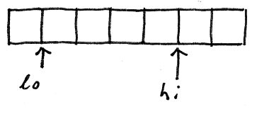

## Half-open ranges

It is often useful to work with only a sub-range of an entire array.
For example, search algorithms often work by narrowing down the portion of an array
in which the sought-for element can be found
(see [binary search](CS1/CS1/Lower-upper-bound.md),
and sort algorithms often work by splitting the array
in pieces and sorting the pieces separately
(see [Mergesort](CS2/Merge-sort.md).

There are also times when we over-allocate an array
so can add items without reallocating and copying the array every time,
and in that case we need to be able to deal with
only the first N elements of the array.

There are two basic ways of identifying an array sub-range:
closed ranges, and half-open ranges.
A closed range is defined as all the elements
starting some index `lo`,
and running up to **and including** index `hi`.
A half-open range begins some at some index `lo`,
and extends up to **but not including** `hi`.

In this section,
I hope to convince you that using half-open ranges
is the most natural and least error-prone of the two techniques
for working with sub-ranges of arrays.
We will also [re-implement our basic algorithms](Basic-algorithms-subranges.md)
so that they work with sub-ranges of arrays.

### Notation

For our purposes, a range is generally a series of consecutive array elements.
There are three types of ranges:
* A closed range, denoted `[lo,hi]`, includes both its endpoints.
For example, `[2,5]` is the set `{ 2, 3, 4, 5 }`.
* An open range, denoted `(lo,hi)`, includes neither endpoint.
For example, `(2,5)` is the set `{ 3, 4 }`.
* A half-open range, denoted `[lo,hi)` or `(lo,hi]`, which contains one endpoint but not the other.
For example, `[2,5)` is the set `{ 2, 3, 4 }`, and `(2,5]` is the set `{ 3, 4, 5 }`.

Note that some texts will refer to closed ranges as "symmetric" ranges,
and half-open ranges as "asymmetric".

### Diagrams

When working with half-open ranges,
it is natural to draw diagrams like this:



Note that arrows indicating the `lo` and `hi` indices
are placed at the boundary between two items.
The convention is that we place the label
at the left-hand boundary of the array element.
So, for example, the following diagram
shows the half-open range `[3,7)`:


It is easy to see here that the given range `[lo,hi)`
consists of the elements between the arrows.

### Usage

In languages in which arrays begin at 0 (that is, nearly every language in common use today),
it is almost always best to think in terms of half-open sub-ranges of the form `[lo,hi)`.
In fact, you're probably already used to doing this in the most common case.

Consider the canonical loop for processing all the elements of an array:
```
for (int i = 0; i < A.length; i++)
```
Note that we're effectively thinking in terms of the half-open range `[0,A.length)`.
No experienced programmer would ever use the equivalent closed range code:
```
// No experienced programmer does this.
for (int i = 0; i <= A.length-1; i++)
```
However, many programmers (and programming texts) tend to process a sub-range of an array like this:
```
// Process elements in [lo,hi] (a closed range)
for (int i = lo; i <= hi; i++)
```
For some reason, when switching from processing a full array to processing a portion of an array,
many programmers switch to thinking in terms of closed ranges.

Personal experience shows that this inconsistency is the cause of many off-by-one defects.
It is better to consistently treat array sub-ranges as half-open arrays.
This experience is reflected in, for example, the C++ standard library and Python's use of array sub-ranges.

Consider the common case of splitting an array in half and processing the two halves separately.
Using a closed range, we get:
```
// Process [lo,hi] recursively in two parts
process(A, lo, hi)
    // test for an empty or 1-element range
    if (hi - lo + 1) <= 1
        return
    index mid = lo + (hi - lo) / 2
    process(A, lo, mid-1)  // process [lo,mid-1]
    process(A, mid, hi)    // process [mid,hi]
    // combine results
```
Now consider the same algorithm using half-open ranges:
```
// Process [lo,hi) recursively in two parts
process(A, lo, hi)
    // test for an empty or 1-element range
    if (hi - lo) <= 1
        return
    index mid = lo + (hi - lo) / 2
    process(A, lo, mid)    // process [lo,mid)
    process(A, mid, hi)    // process [mid,hi)
    // combine results
```
The important difference is that the half-open range code does not have to adjust the ranges by 1 when
(1) calculating the length of the range (`hi - lo + 1`), and
(2) making the recursive call (`mid-1`).
It is extremely easy to make off-by-one errors in these calculations,
which are notably absent altogether in the code using half-open ranges.

In fact, did you even notice that there's a very serious bug in the code using closed ranges?
I'll leave it to you to find it.

Note that because `[lo,mid)` does not contain `mid`, and `[mid,hi)` does,
there is no need to adjust `mid` in either recursive call.
This same pattern can be used when splitting the range in any number of sub-ranges.
Consider the case of splitting into 3 sub-ranges:
```
// Process [lo,hi) recursively in three parts
process(A, lo, hi)
    // test for an empty or 1-element range
    if (hi - lo) <= 1
        return
    index mid1 = lo +  (hi - lo)      / 3
    index mid2 = lo + ((hi - lo) * 2) / 3
    process(A, lo,   mid1)
    process(A, mid1, mid2)
    process(A, mid2, hi)
    // combine results
```
It's instructive to trace what happens when this code is called with 1-element, 2-element,
and 3-element sub-ranges.

### Other advantages

There are other advantages to using half-open ranges.
Consider calculating the size of a closed range `[lo,hi]`:
```
    integer range_size = hi - lo + 1
```
Again, that `+ 1` is easy to forget.
For a half-open range `[lo,hi)`, on the other hand, we have the simpler
```
    integer range_size = hi - lo
```
Be aware, however, that `[2,2)` is an empty range;
this does seem a bit counter-intuitive at first,
but it's really no worse than the fact
that the corresponding closed range would be `[2,1]`.

Finally, using half-open ranges makes it much easier to state loop invariants,
and do correctness arguments.
For a good example of this,
see the [lower_bound() and upper_bound()](Lower-upper-bound.md) algorithms.

### Language support

C++ and Python, in particular, use half-open ranges extensively.

The C++ Standard Template Library algorithms
are all defined in terms of half-open ranges.
Every algorithm works on a sub-range
of a collection specified by a pair of iterators
(generally called `begin` and `end`),
the first of which specifies the first element to process,
and the second is one past the last item to process.
Most C++ algorithms look like this:
```
some_algorithm(iter begin, iter end)
    iter i = begin;
    while i != end
        process element referenced by i
        i++
```
The Python language has is a `range` function
which generates a range of integers,
specified as a half-open range.
For example, `range(2,5)` generates the range `[2,5) = { 2, 3, 4 }`.
With a single argument, `range` produces a rage starting at 0; `range(3)`
generates the range `[0,3) = { 0, 1, 2 }`.

Python also has a notation for splicing a list (what Python calls an array)
that generates a half-open sub-range of the list.
`my_list[2:5]` is a sub-range of `my_list`
consisting of elements `my_list[2]`, `my_list[3]`, and `my_list[4]`.

### Basic algorithms

[This page](Basic-algorithms-subranges.md) discusses
rewriting our basic array algorithms to work with
half-open ranges.
