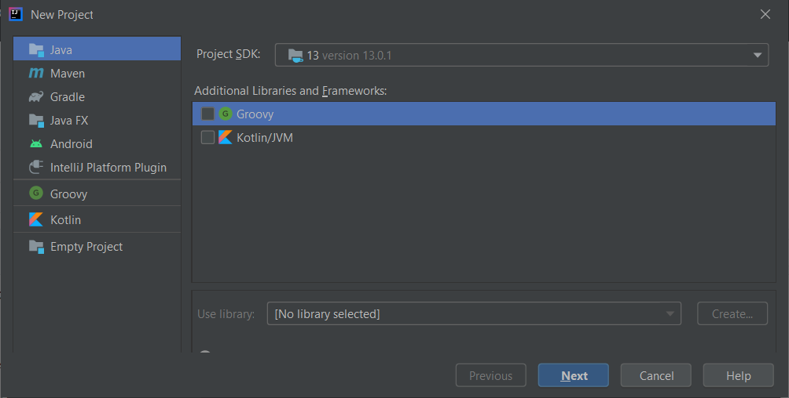
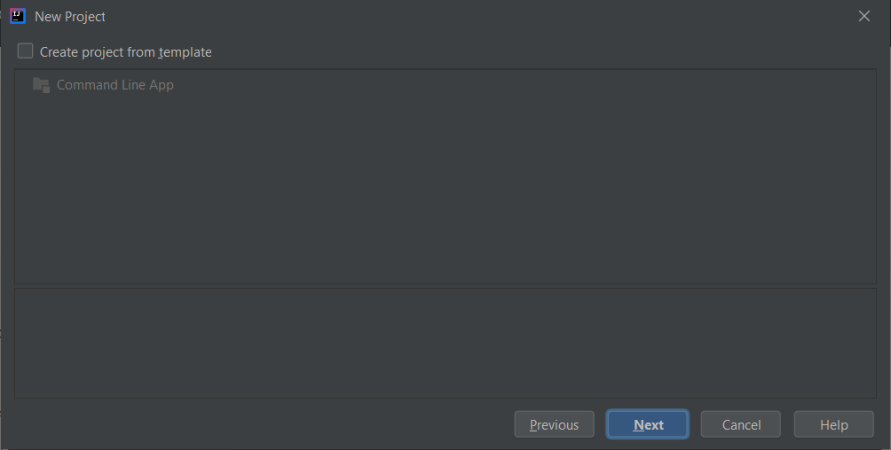
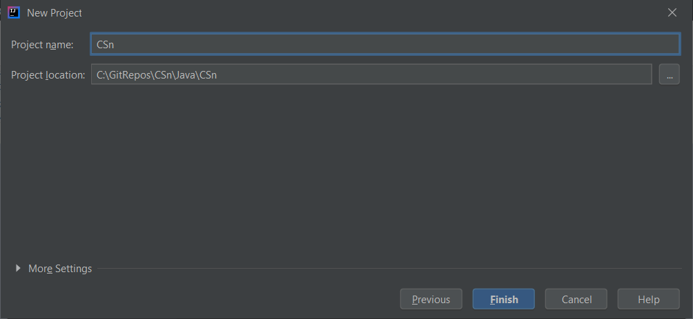
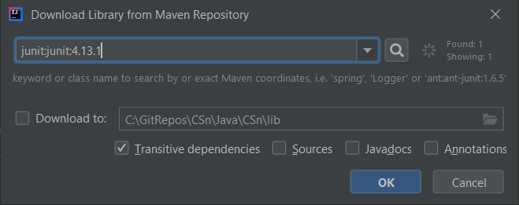
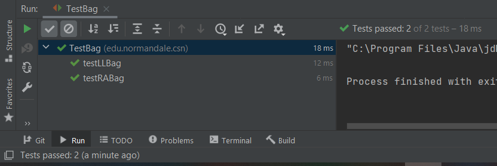

# Instructions for IntelliJ

This documentation assumes you have already cloned the CSn repo.
I wrote this before getting fully acquainted with IntelliJ,
so if there are easier/better ways to do some of these steps,
let me know.

I set up different projects for each directory here (ClassDemos and CSn).
The instructions here will describe setting up an IntelliJ project
for CSn; the instructions for ClassDemos will be the same, but with
ClassDemos substituted for CSn.

1. From the Welcome To IntelliJ IDEA dialog, select `New Project`.
2. Take all the defaults, and click Next:

3. In the next dialog, take all the defaults again, and click Next:

4. In the next dialog, set the Project Name to "CSn", and the Project Location to CSn/Java/CSn:

5. In the Project window, right-click on src and select Mark Directory As /  Unmark as Sources Root.
6. In the Project window, right-click on src and select Delete.
7. In the Project window, right-click on CSn and select Mark Directory As / Sources Root.

For the CSn project:

8. Open the edu.normandale.csn folder.
9. Open one of the test classes (e.g. TestBag.java).
10. Open the Problems tab in the bottom window.
11. Right-click on one of the "Cannot resolve JUnit4" messages, and select Show Quick Fixes, then select Add Junit4 to Classpath.
12. In the "Download Library from Maven Repository" dialog, accept the defaults and click OK:

As a final test, right-click in the TestBag editor window, and select Run.
TestBag should run and pass all the tests:

