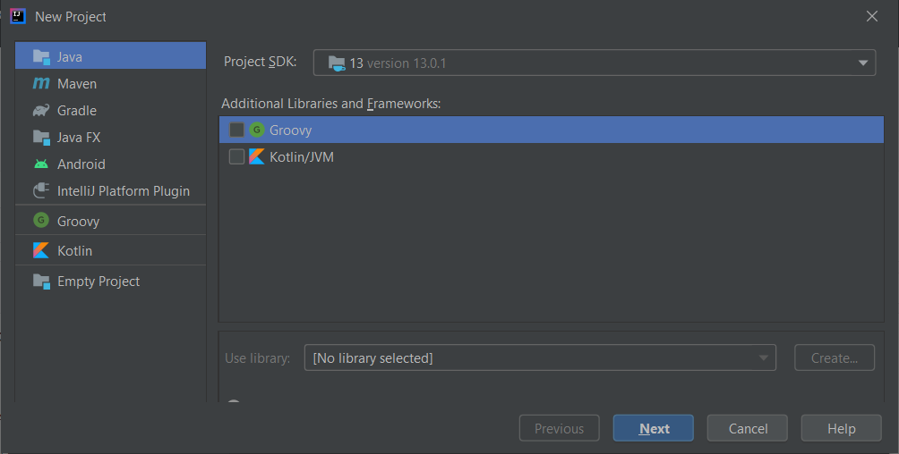

# Instructions for IntelliJ

This documentation assumes you have already cloned the CSn repo.

I set up different projects for each directory here (ClassDemos and CSn).
The instructions here will describe setting up an IntelliJ project
for CSn; the instructions for ClassDemos will be the same, but with
ClassDemos substituted for CSn.

1. From the Welcome To IntelliJ IDEA dialog, select `New Project`.
2. Select Java in the left-hand menu, no additional libraries and frameworks, 

